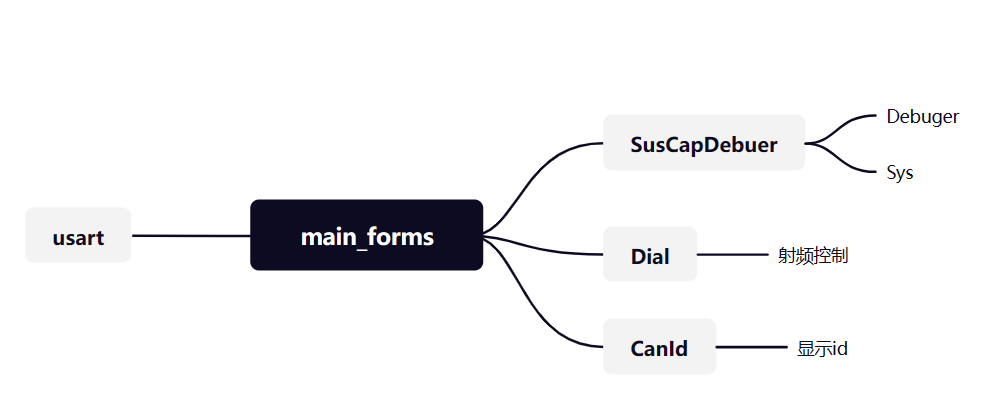

#### 调试器电路

##### 主控（stm32f401rct6）

##### 屏幕（tft屏）

##### 闪存（W25Q32JVSSIQ）

##### 触摸功能（XPT2946）

##### 按键

#### 代码

##### tft屏驱动

- tft屏幕与主控使用spi通讯，然后为了提高屏幕的刷新率，我使用了DMA进行数据的传输。
- tft屏幕的配置更多还是使用网上的库，方便直接。
- 学会更好的使用DMA

##### 触摸功能

- 触摸的功能相对于tft屏幕的驱动来说，是比较好写，但是要完善也还不是很容易，它的功能还需再来研究。

==这两部分可以借鉴老朱的代码（手动狗头），养成写注释的习惯，等到功能写出来再来整理到readme中==

# Debegger

## 代码的设计

### tft屏幕显示

- spi的配置，如下图：（然后再开启个DMA就可以了）

- 屏幕的初始化还是使用普通的方法对其进行初始化（那些初始化的指令还没去了解）。

- 首先是屏幕的设计，目前的想法是，先将一整个屏幕的数据处理完，再使用DMA传输一次性完成传输。（已完成）

- 先将要处理的像素点存储到数组中

~~~c
volatile unsigned char lcd_buffer[128 * 160 * 2] = {0};

~~~

然后直接使用DMA将数据传输到ftf屏中

~~~c
    HAL_SPI_Transmit_DMA(&hspi3, (uint8_t *) lcd_buffer, 128 * 160 * 2);
~~~

- 然后就是对数组的处理了，每一个数组对应tft屏中的一个像素点，所以在处理时，只需将对应的像素点输入对应的颜色指令即可。
  - 在此代码中对应的字符大小为12*6，即宽为6像素，高为12像素。
  - 处理字符时，先从行开始处理的，依次向下处理。
  - 至于其他的方框，就是直接抄袭老朱的代码。（还需待我看懂）

### 串口数据的处理

##### 配置

- 首先是串口的接口，在本调试器中，使用的串口是USART1和UART4

  - usart1：typeC接口，具有usb2ttl芯片

    PA10->RX

    PA9->TX

  - uart4：使用的是gh1.25的接口。

    PC10->TX

    PC11->RX

- 发送数据的时候，还是用了轮询模式。接收数据的时候，使用的是中断模式。

##### 数据类型转换

- 串口传输的是8位的数，所以如果要传输更长的数据类型，需要转换一下数据的类型。在本例程中要传输的是float的数据，所以float和unsigned short 两种类型的数据相互转换。

- 将float转换为unsigned short

  ~~~c
  unsigned short FloatToInt16(float data0)
  ~~~

- 将unsigned short转换为float

  ~~~c
  float Int16ToFloat(unsigned short data0)
  
  ~~~

  

##### 传输格式

- 目前暂定传输和接收4个float类型数据（这四个数据分别为data1、data2、data3、data4）。使用长度为11的数据。

| 0    | 1    | 2    | 3    | 4    | 5    | 6    | 7    | 8    | 9      | 10   |
| ---- | ---- | ---- | ---- | ---- | ---- | ---- | ---- | ---- | ------ | ---- |
| 0xff | 高位 | 低位 | 高位 | 低位 | 高位 | 低位 | 高位 | 低位 | 校准位 | 0xff |

- 第零位为起始位，指定为0xff，低十位为结束位，指定为0xff。
- 第1位是data1的高8位，第2位是data1低8位。其他的以此类推。
- 第9位是校准位，其实起这个名字可能不太合适，这一位的作用就是用来表示接收了多少个有效数据（非零数据）

## 图形界面的设计

### 现阶段流程图

- 在每一个界面中都有一个TurnBuck选项（除了main_forms界面），按下此界面就会回到上一个界面。这个回调的方法不知是要不要使用链表（有待思考）。

- 图形界面只是使用了按键（Button）以及标签（label）来设计的简易界面。Key1用来移动光标，Key2用来确定进入相依的界面，并使用回调函数还进行初始化，配合链表可能会有更好的效果。

### 设计思路

- key1为选择键，当key1按下时key_Select_flag++；同时相应的button将会高亮表示被选择到。
- 当按下key2时，为确定按键。此时key_Verify_flag=1。此时将会根据key_Select_flag的值调用 相应 的回调函数 进入相应的界面。然后key_Verify_flag被重新置零。
- 此流程是相对较简单的。后面的想法是使用链表来实现界面的切换 。

