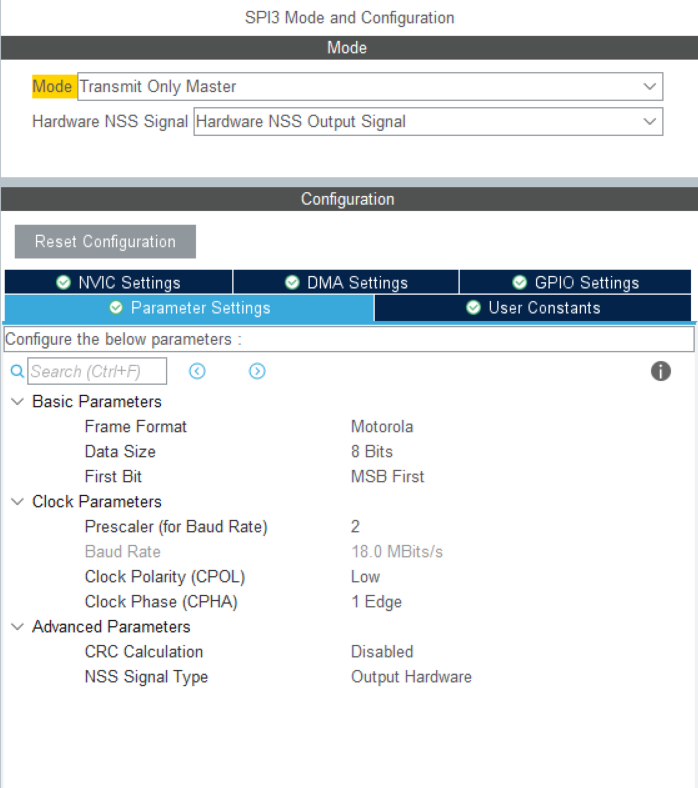

#### 调试器电路

##### 主控（stm32f401rct6）

##### 屏幕（tft屏）

##### 闪存（W25Q32JVSSIQ）

##### 触摸功能（XPT2946）

##### 按键

#### 代码

##### tft屏驱动

- tft屏幕与主控使用spi通讯，然后为了提高屏幕的刷新率，我使用了DMA进行数据的传输。
- tft屏幕的配置更多还是使用网上的库，方便直接。
- 学会更好的使用DMA

##### 触摸功能

- 触摸的功能相对于tft屏幕的驱动来说，是比较好写，但是要完善也还不是很容易，它的功能还需再来研究。

==这两部分可以借鉴老朱的代码（手动狗头），养成写注释的习惯，等到功能写出来再来整理到readme中==

# Debegger

## 代码的设计

### tft屏幕显示

- spi的配置，如下图：（然后再开启个DMA就可以了）

- 屏幕的初始化还是使用普通的方法对其进行初始化（那些初始化的指令还没去了解）。

- 首先是屏幕的设计，目前的想法是，先将一整个屏幕的数据处理完，再使用DMA传输一次性完成传输。（已完成）

- 先将要处理的像素点存储到数组中

~~~c
volatile unsigned char lcd_buffer[128 * 160 * 2] = {0};

~~~

然后直接使用DMA将数据传输到ftf屏中

~~~c
    HAL_SPI_Transmit_DMA(&hspi3, (uint8_t *) lcd_buffer, 128 * 160 * 2);
~~~

- 然后就是对数组的处理了，每一个数组对应tft屏中的一个像素点，所以在处理时，只需将对应的像素点输入对应的颜色指令即可。
  - 在此代码中对应的字符大小为12*6，即宽为6像素，高为12像素。
  - 处理字符时，先从行开始处理的，依次向下处理。
  - 至于其他的方框，就是直接抄袭老朱的代码。（还需待我看懂）

## 图形界面的设计

### 现阶段流程图

- 在每一个界面中都有一个TurnBuck选项（除了main_forms界面），按下此界面就会回到上一个界面。这个回调的方法不知是要不要使用链表（有待思考）。

- 图形界面只是使用了按键（Button）以及标签（label）来设计的简易界面。Key1用来移动光标，Key2用来确定进入相依的界面，并使用回调函数还进行初始化，配合链表可能会有更好的效果。

### CanId界面

